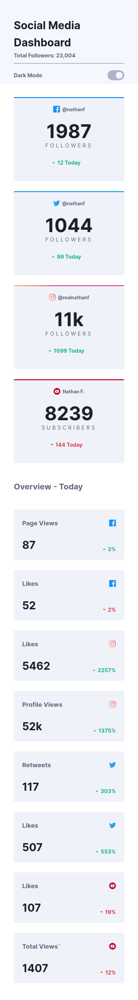
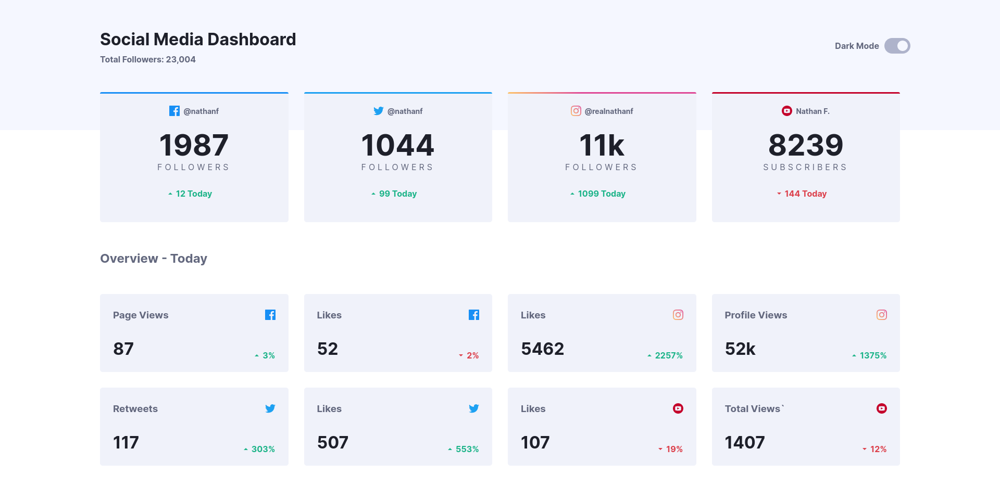

# Frontend Mentor - Social media dashboard with theme switcher solution

This is a solution to the [Social media dashboard with theme switcher challenge on Frontend Mentor](https://www.frontendmentor.io/challenges/social-media-dashboard-with-theme-switcher-6oY8ozp_H). Frontend Mentor challenges help you improve your coding skills by building realistic projects.

## Table of contents

- [Overview](#overview)
  - [The challenge](#the-challenge)
  - [Screenshot](#screenshot)
  - [Links](#links)
- [My process](#my-process)
  - [Built with](#built-with)
  - [What I learned](#what-i-learned)
  - [Useful resources](#useful-resources)

## Overview

### The challenge

Users should be able to:

- View the optimal layout for the site depending on their device's screen size
- See hover states for all interactive elements on the page
- Toggle color theme to their preference

### Screenshot




### Links

- Solution URL: [solution](https://github.com/mohamedyasser27/social-media-dashboard-with-theme-switcher)
- Live Site URL: [site](https://mohamedyasser27.github.io/social-media-dashboard-with-theme-switcher)

## My process

### Built with

- Mobile-first workflow
- Semantic HTML5 markup
- CSS custom properties
- Flexbox

### What I learned

- how to create a dark mode switcher
- how to create grid with columns that has a minimum width and the grid doesn't exceed a certain number of columns

```css
.grid{
  grid-template-columns: 
  --gap:20px;
  display:grid;
  grid-template-columns:repeat(
    auto-fit,
    minmax(clamp(250px, calc((100% - var(--gap)) / 4), 300px), 1fr);
  );
}
```

### Useful resources

- [dark mode switcher](https://css-tricks.com/a-complete-guide-to-dark-mode-on-the-web/) - a useful article on dark mode

- [min function](https://www.youtube.com/watch?v=7khSaA91e04) - a very good video to wrap your head around how min function works

- [min,max,clamp functions](https://www.youtube.com/watch?v=U9VF-4euyRo) - useful video on those functions

- [dynamic grid](https://stackoverflow.com/questions/52417889/setting-minimum-and-maximum-number-of-columns-using-css-grid) - helped a lot with creating a dynamic grid
